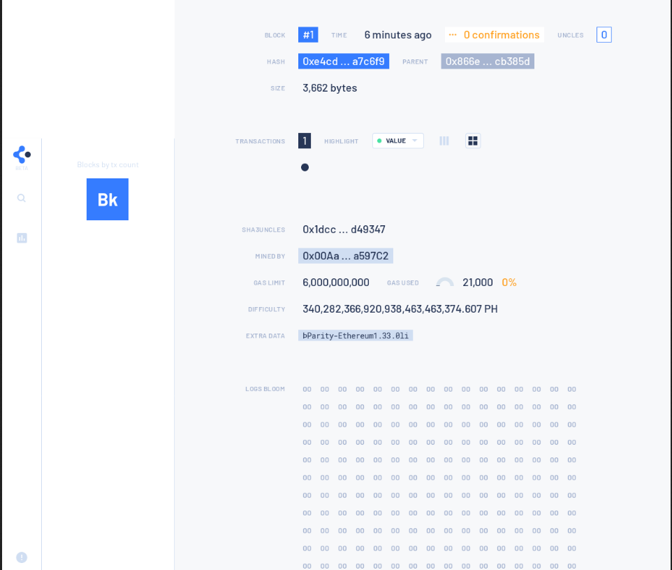

# Getting started with Parity

This tutorial uses parity-ethereum to run a private client network locally and connects it to alethio's block explorer(Ethereum Lite Explorer) and monitoring (Ethstats) platform.

Prerequisites
To run this tutorial, you must have the following installed:

- Linux
- Git command line
- Docker and Docker-compose

## Setting up parity Node
First let's see how you can set up a private node, we'll be building parity-ethereum from source for this

### Building from source

Clone parity-ethereum from [here](https://github.com/paritytech/parity-ethereum)
```
git clone https://github.com/paritytech/parity-ethereum
cd parity-etherum
```
**Install the prerequisites to run parity node as described [here](https://github.com/paritytech/parity-ethereum#build-dependencies)**

To include rust in your path variable of current shell do <br/>
`source $HOME/.cargo/env`

Run `cargo build --release --features final` you'll get a release file in `./target/release`

To see various flags and options to start a node <br/> 
run `./target/release/parity --help`

Lets **start** now by running<br/> 
`./target/release/parity --light --jsonrpc-interface all --ws-interface all  --ws-hosts all --ws-origins all`

### Using Docker 
Run `docker run -d --restart always --name parity-light -p 127.0.0.1:8545:8545 parity/parity:stable --light --jsonrpc-interface all` to download parity image locally and start it.


## Setting up a private chain using couple of nodes

### Using Docker
Clone [this](https://github.com/nanspro/parity-demo-alethio) repo to instantly setup a network consisting of 3 authorities and 3 members.
```
git clone https://github.com/nanspro/parity-demo-alethio
cd parity-demo-alethio
```

**Starting Network** <br/>
`docker-compose up -d`

_Note_: If use get some version error, then use parity v2.5.0 and then<br/>
`export PARITY_VERSION=v2.5.0`

And now our network is live on "localhost:8545"

#### Accounts
There is already an account with an empty password that has enough ether:

```
0x6B0c56d1Ad5144b4d37fa6e27DC9afd5C2435c3B
```

And another who is broke:
```
0x00E3d1Aa965aAfd61217635E5f99f7c1e567978f
```

You may also want to change the list of prefunded accounts in `parity/config/chain.json`.

Add JSON-formatted ethereum accounts to `parity/keys` and they will appear in the UI.

#### Access JSON RPC 
Talk to JSON RPC at [http://127.0.0.1:8545](http://127.0.0.1:8545) with your favorite client.

Be kind and send the poor an ether!

```
curl --data '{"jsonrpc":"2.0","method":"personal_sendTransaction","params":[{"from":"0x6B0c56d1Ad5144b4d37fa6e27DC9afd5C2435c3B","to":"0x00E3d1Aa965aAfd61217635E5f99f7c1e567978f","value":"0xde0b6b3a7640000"}, ""],"id":0}' -H "Content-Type: application/json" -X POST localhost:8545
```

## Connecting with Block Explorer
We'll use alethio's lite-explorer to view our network blocks with an amazing UI

On another terminal clone the **ethereum lite explorer**
```
git clone git@github.com:Alethio/ethereum-lite-explorer.git
cd ethereum-lite-explorer
```

Install dependencies<br/>
`npm install`

Build<br/>
`npm run build`

Copy the default config into dev config like this `cp config.default.json config.dev.json`<br/>
Open the config.dev.json and change the `APP_NODE_URL = 'http://127.0.0.1:8545'` to connect to your network.

Run `npm start` now and in a new tab a explorer will open showing block stats for the network like this


You can view our the transaction done using curl earlier in the blocks




## Connecting with Network Stats Dashboard
We'll use alethio's **network stats dashboard** to view our network blocks with an amazing UI

### ethstats-network-server
First we need to start the `ethstats-network-server` from which our dashboard will fetch data.
```
git clone https://github.com/Alethio/ethstats-network-server
cd ethstats-network-server
```
We can run the server normally or in lite-mode, for this tutorial we will use **lite-mode**

There are 2 ways to start the server in lite mode.

- Memory persistence - in case of a crash/restart the gathered data is lost.
- Redis persistence - in case of a crash/resstart the gathered data is persisted into Redis.

```
cd docker/lite-mode/{choice_to_start}
docker-compose up
```

_Note_: You can change the ports for running different components in `docker-compose.yml`

### ethstats-cli
Now we need `ethstats-cli` to fetch data from our node and pass it to network-server

We'll be using docker to pull and run, to use the cli first a node is required to register
```
mkdir config
docker run -d \
--restart always \
--net host \
-v /home/config/:/root/.config/configstore/ \
alethio/ethstats-cli --register --account-email your@email.com --node-name your_node_name --server-url http://localhost:3000
```

CLI Options

```
--server-url The url where our network-server is running
--account-email Your email account (you can use it later to sign in to https://net.ethstats.io)
--node-name name of your node
```

_Note_: The app is configured by default to connect to the Ethereum node on your local host (http://localhost:8545). To connect to a node running on a different host use flag `--client-url`.

Now we have ethstats-cli running in a container, fetching data from our node and passing it to network-server 

Finally it's time to setup our dashboard

### ethstats-network-dashboard
On another terminal run
```
git clone git@github.com:Alethio/ethstats-network-dashboard.git
cd ethstats-network-dashboard
```
Install dependencies<br/>
`npm install`

Build<br/>
`npm run build`

Copy the default config into dev config like this `cp config.js.example config.js`

_Note_: You can change the port in config.js or pass it as flag while running like this `npm start --port 4040`

Run `npm start --port 4040` now and in a new tab a explorer will open showing network stats for the network like this


## License

MIT &copy; [Alethio](https://aleth.io)


